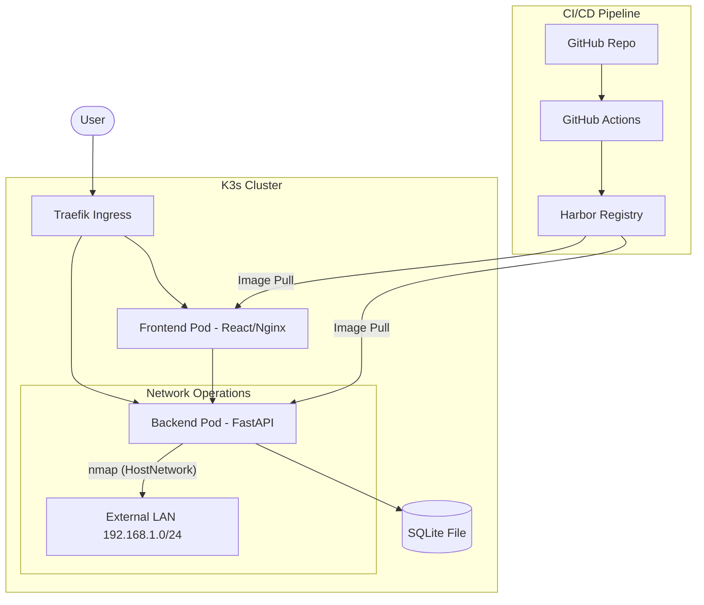

# Technical Architecture - NeonDeck

Detailed technical architecture of the NeonDeck application, a network discovery and service inventory solution designed for homelabs and K3s environments.

## 🏗️ High-Level Architecture

## 🔌 Core Components

### 1. Backend (FastAPI)
- **Framework**: Python 3.11 with FastAPI (Asynchronous).
- **Scanner Engine**: Wraps `nmap` using `python-nmap`. Optimized for containerized environments.
- **Auto-Categorizer**: Regex-based engine that identifies services (Monitoring, Media, etc.) based on titles, URLs, and metadata.
- **Probe Engine**: Asynchronous HTTP/HTTPS client for extracting titles, descriptions, and favicons.
- **Database**: PostgreSQL with SQLAlchemy (Async).

### 2. Frontend (React)
- **Framework**: React 18 + Vite.
- **Styling**: TailwindCSS with a custom **Cyberpunk Design System** (custom color tokens for cyan, magenta, and dark backgrounds).
- **Communication**: Axios for REST API and planned WebSockets for real-time scan updates.

### 3. Database
- **SQLite**: Stores persistent data (Categories, Services, Scan History) in a persistent volume. Simple and zero-maintenance for production.

## 🌐 Networking Strategy

### Discovery Mechanism
The application uses a two-stage discovery process:
1. **Network Layer**: `nmap` scans defined subnets (`SCAN_NETWORKS`) for hosts with open web ports.
2. **Application Layer**: An HTTP probe attempts to connect to each identified host:port to extract metadata and verify the service type.

### K3s Specifics
To enable network discovery from within a Kubernetes cluster:
- **Host Networking**: The backend pod uses `hostNetwork: true` to bypass the overlay network and see the physical LAN.
- **Capabilities**: The Nmap binary is granted `CAP_NET_RAW` to allow it to perform privileged scanning operations (like OS detection or faster syn-scans) without running as root.

## 🔒 Security Model

- **Non-Root Execution**: Both frontend and backend containers run as unprivileged users.
- **Capability Management**: `NET_RAW` is granted only to the specific Nmap binary via `setcap`.
- **Secret Management**: Integrated with Kubernetes Secrets, supporting future HashiCorp Vault integration.
- **CORS Policies**: Strict CORS origins configured in production via ConfigMaps.

## 🚀 CI/CD & DevOps

- **Multi-Stage Builds**: Dockerfiles are optimized for small production footprints.
- **Automatic Deployment**: GitHub Actions automates linting, testing, building (Harbor), and deploying to K3s (kubectl).
- **Infrastructure as Code**: All Kubernetes manifests (PostgreSQL, Redis, Services, Ingress) are stored in the `k8s/` directory.
